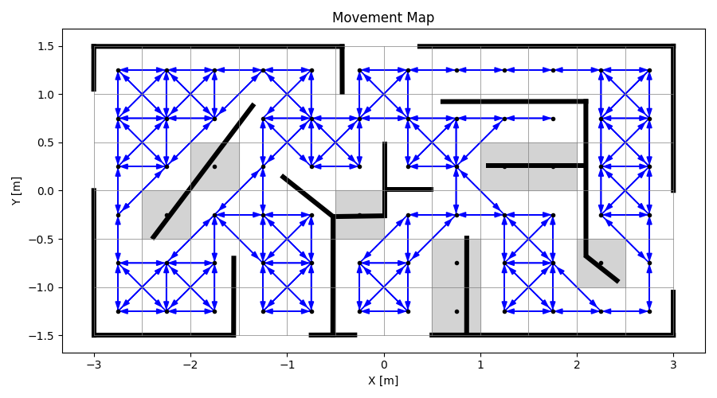
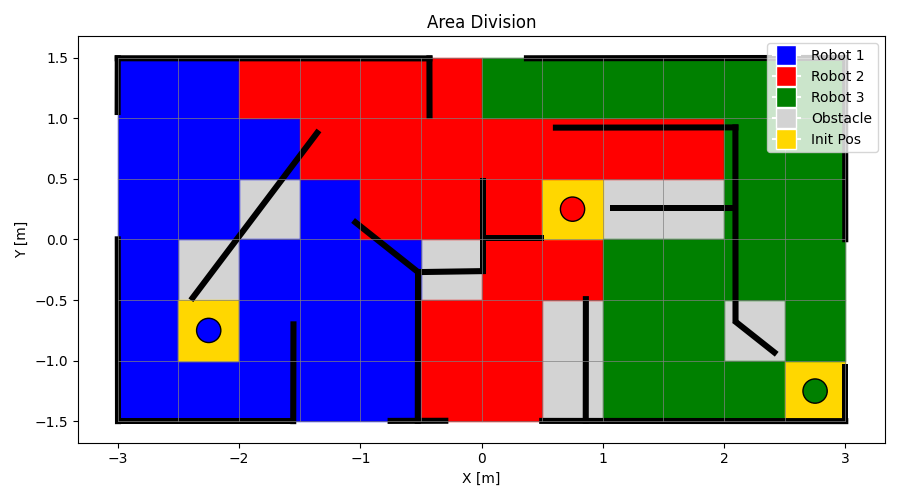
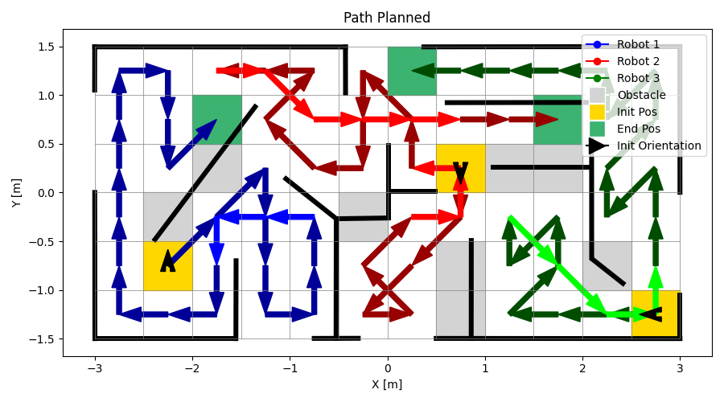

# Multi-Robot Path Planning for Coverage in Cluttered and Known Environment

## Motivation

DARP [1] divides in an iterative manner the areas based on the robots initial positions on a known environment to compute a single robot spanning tree coverage (STC) on each subarea. This approach does not suit cluttered environment as STC requires cell subdivision and DARP does not take obstacles into account in the distance metrics.


## Previous Work

DARP was extended to A* DARP to take the obstacles into account, replacing the euclidean distance by the A* path length as distance metric between two cells.

An &epsilon;* based greedy single robot coverage path planner (CPP) [2] was developped. It does not require cell subdivision and is used to replace the STC initially used by DARP and A* DARP.


## Contribution

The contribution is detailled in the [report](report.pdf).

### Environment

The environment is considered as cluttered if narrow passages have the same width as the length of a grid cell. This grid cell length represents the work area of the robot and can be different than its actual footprint.

The environment is represented by a grid but each cell has connected cells list, because two free neighbour cells are not necessary connected, as they can be separated by a thin obstacle. The Movement Map below is computed based on the obstacles, robot's footprint and workspace diameters. The obstacles are built using the [Shapely python library](https://shapely.readthedocs.io/en/2.0.6/reference/shapely.intersects.html) and can be changed in the ```map.py``` script.

<p align="center">
  
</p>


### Multi-robot coverage


A* DARP and &epsilon;* based CPP are extended 


<p align="center">
  
</p>


<p align="center">
  
</p>


## Installations

#### Install
```
git clone https://github.com/RaphaelDssn/Multi-Robot-Path-Planning-for-Coverage-in-Cluttered-and-Known-Environment.git
```


#### Requirements

This project was created using following library versions:

* Python3 (3.12.3)

* numpy (2.1.3)
* tabulate (0.9.0)
* matplotlib (3.10.0)
* shapely (2.0.7)
* pygame (2.6.1)
* scikit-learn (1.6.1)
* numba (0.61.0)

Install the requirements using:
```
pip install -r requirements.txt
```


## Usage

Run following in a terminal: 

```
cd Multi-Robot-Path-Planning-for-Coverage-in-Cluttered-and-Known-Environment
python3 main.py
```

Following options are available:

<div style="text-align: left;">
  <table style="width: auto; margin-left: auto; margin-right: auto;">
    <tr>
      <th>Option</th>
      <th>Description</th>
      <th>Default Value</th>
    </tr>
    <tr>
      <td><code>-h, --help</code></td>
      <td>Show help message and exit</td>
      <td>N/A</td>
    </tr>
    <tr>
      <td><code>-cell</code></td>
      <td>Cell dimension (side length) [in meters]</td>
      <td><code>0.5</code></td>
    </tr>
    <tr>
      <td><code>-robot_radius</code></td>
      <td>Robot radius [in meters]</td>
      <td><code>0.1</code></td>
    </tr>
    <tr>
      <td><code>-MaxIter</code></td>
      <td>Maximum number of iterations for DARP</td>
      <td><code>2000</code></td>
    </tr>
  </table>
</div>

Modify the environment in ```map.py``` and the robot's footprint and workspace diameters and initial position and orientation in ```main.py```in the [config dictionnary](main.py#L308)


## References

Only used Github Repositories are cited here. See the report for a complete bibliography.

[1] Alice-St. Alice-st/darp. https://github.com/alice-st/DARP, n.d. Accessed: 21 December 2024.

[2] Rodriguesrenato. Rodriguesrenato/coverage-path-planning: A coverage path planning algorithm that combines multiple search algorithms to find a full coverage trajectory with the lowest cost. https://github.com/rodriguesrenato/coverage-path-planning, n.d. Accessed: 21 December 2024.


## License


- [1] is covered under the [Creative Commons Attribution-NonCommercial 4.0 International License](http://creativecommons.org/licenses/by-nc/4.0/)
- [2] is covered under the MIT License

This work is therefore also covered by the [Creative Commons Attribution-NonCommercial 4.0 International License](http://creativecommons.org/licenses/by-nc/4.0/).


## Cite as
```
@techreport{mCPP_cluttered,
  author      = {Raphaël Dousson},
  title       = {Multi-Robot Path Planning for Coverage in Cluttered and Known Environment},
  year        = {2024},
  type        = {Semester Project},
  institution = {Sycamore Lab, EPFL},
  url         = {https://github.com/RaphaelDssn/Multi-Robot-Path-Planning-for-Coverage-in-Cluttered-and-Known-Environment},
  note        = {Supervised by Kai Ren and Prof. Maryam Kamgarpour}
}
```